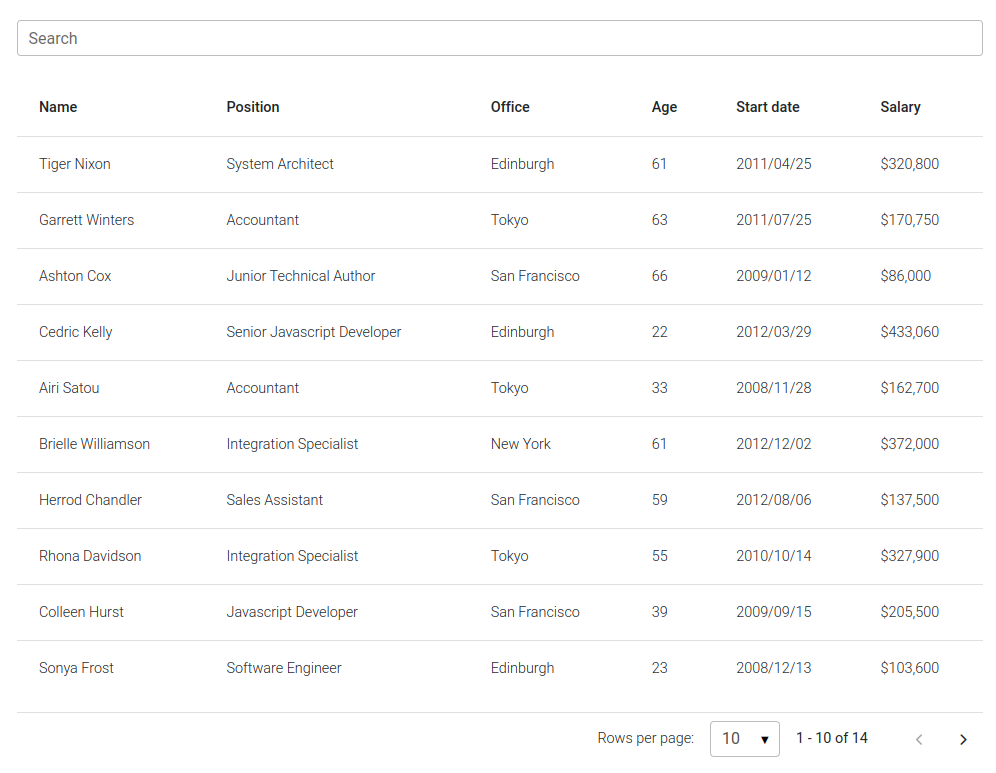

Responsive Table Filter built with React Bootstrap 5. Search filter is the most common useful table control. Filter any table with ease using datatables features.

Check out [React Bootstrap Table filter Documentation](https://mdbootstrap.com/docs/react/extended/table-filter/) for detailed instructions & even more examples.

## Basic example

## How to use?

1. Download MDB React - free UI KIT

2. Choose your favourite customized component and click on the image

3. Copy & paste the code into your MDB project

[▶️ Subscribe to YouTube channel for web development tutorials & resources](https://www.youtube.com/MDBootstrap?sub_confirmation=1)

___

## More extended Bootstrap documentation

<ul>
<li><a href="https://mdbootstrap.com/docs/react/extended/code/">React Bootstrap Code</a></li>
<li><a href="https://mdbootstrap.com/docs/react/extended/gallery/">React Bootstrap Gallery</a></li>
<li><a href="https://mdbootstrap.com/docs/react/extended/hamburger-menu/">React Bootstrap Hamburger Menu</a></li>
<li><a href="https://mdbootstrap.com/docs/react/extended/jumbotron/">React Bootstrap Jumbotron</a></li>
<li><a href="https://mdbootstrap.com/docs/react/extended/maps/">React Bootstrap Maps</a></li>
<li><a href="https://mdbootstrap.com/docs/react/extended/mega-menu//">React Bootstrap Mega Menu</a></li>
<li><a href="https://mdbootstrap.com/docs/react/extended/media-object/">React Bootstrap Media object</a></li>
<li><a href="https://mdbootstrap.com/docs/react/extended/multiselect/">React Bootstrap Multiselect</a></li>
<li><a href="https://mdbootstrap.com/docs/react/extended/masonry/">React Bootstrap Masonry</a></li>
<li><a href="https://mdbootstrap.com/docs/react/extended/contact/">React Bootstrap Contact form</a></li>
<li><a href="https://mdbootstrap.com/docs/react/extended/gradients/">React Bootstrap Gradients</a></li>
<li><a href="https://mdbootstrap.com/docs/react/extended/pagination/">React Bootstrap Pagination</a></li>
<li><a href="https://mdbootstrap.com/docs/react/extended/panels/">React Bootstrap Panels</a></li>
<li><a href="https://mdbootstrap.com/docs/react/extended/social-media/">React Bootstrap Social Media icons & buttons</a></li>
<li><a href="https://mdbootstrap.com/docs/react/extended/search/">React Bootstrap Search</a></li>
<li><a href="https://mdbootstrap.com/docs/react/extended/table-sort/">React Bootstrap Table sort</a></li>
<li><a href="https://mdbootstrap.com/docs/react/extended/table-responsive/">React Bootstrap Table responsive</a></li>
<li><a href="https://mdbootstrap.com/docs/react/extended/table-scroll/">React Bootstrap Table scroll</a></li>
<li><a href="https://mdbootstrap.com/docs/react/extended/table-search/">React Bootstrap Table search</a></li>
<li><a href="https://mdbootstrap.com/docs/react/extended/textarea/">React Bootstrap Textarea</a></li>
<li><a href="https://mdbootstrap.com/docs/react/extended/sidebar/">React Bootstrap Sidebar</a></li>
<li><a href="https://mdbootstrap.com/docs/react/extended/profiles/">React Bootstrap Profiles</a></li>
<li><a href="https://mdbootstrap.com/docs/react/extended/dropdown-multilevel/">React Bootstrap Nested Dropdown</a></li>
<li><a href="https://mdbootstrap.com/docs/react/extended/bootstrap-address-form/">React Bootstrap Address Form</a></li>
<li><a href="https://mdbootstrap.com/docs/react/extended/back-to-top">React Scroll Back to Top button</a></li>
<li><a href="https://mdbootstrap.com/docs/react/extended/product-cards">React Product Cards</a></li>
<li><a href="https://mdbootstrap.com/docs/react/extended/avatar">React Avatar</a></li>
<li><a href="https://mdbootstrap.com/docs/react/extended/carousel-with-thumbnails">React Carousel Slider with Thumbnails</a></li>
<li><a href="https://mdbootstrap.com/docs/react/extended/chat">React Chat</a></li>
<li><a href="https://mdbootstrap.com/docs/react/extended/comparison-table">React Comparison table</a></li>
<li><a href="https://mdbootstrap.com/docs/react/extended/comments">React Comments</a></li>
<li><a href="https://mdbootstrap.com/docs/react/extended/drawer">React Drawer</a></li>
<li><a href="https://mdbootstrap.com/docs/react/extended/faq">React FAQ component / section</a></li>
<li><a href="https://mdbootstrap.com/docs/react/extended/invoice">React Invoice</a></li>
<li><a href="https://mdbootstrap.com/docs/react/extended/news-feed">React News feed</a></li>
<li><a href="https://mdbootstrap.com/docs/react/extended/offcanvas">React Offcanvas</a></li>
<li><a href="https://mdbootstrap.com/docs/react/extended/order-details">React Order details</a></li>
<li><a href="https://mdbootstrap.com/docs/react/extended/page-transitions">React Page transitions</a></li>
<li><a href="https://mdbootstrap.com/docs/react/extended/quotes">React Quotes</a></li>
<li><a href="https://mdbootstrap.com/docs/react/extended/payment-forms">React Payment forms</a></li>
<li><a href="https://mdbootstrap.com/docs/react/extended/select-with-custom-input">React Select with custom Input</a></li>
<li><a href="https://mdbootstrap.com/docs/react/extended/square-buttons">React Square Buttons</a></li>
<li><a href="https://mdbootstrap.com/docs/react/extended/testimonial-slider">React Testimonial Slider</a></li>
<li><a href="https://mdbootstrap.com/docs/react/extended/testimonials">React Testimonials / Reviews</a></li>
<li><a href="https://mdbootstrap.com/docs/react/extended/bootstrap-survey-form">React Survey form</a></li>
<li><a href="https://mdbootstrap.com/docs/react/extended/timeline">React Timeline</a></li>
<li><a href="https://mdbootstrap.com/docs/react/extended/to-do-list">React To Do List</a></li>
<li><a href="https://mdbootstrap.com/docs/react/extended/padding">React Padding</a></li>
<li><a href="https://mdbootstrap.com/docs/react/extended/modal-size">React Modal Size</a></li>
<li><a href="https://mdbootstrap.com/docs/react/extended/modal-backdrop">React Modal Backdrop</a></li>
<li><a href="https://mdbootstrap.com/docs/react/extended/css-text-animations">React CSS Text Animations</a></li>
<li><a href="https://mdbootstrap.com/docs/react/extended/video">React Video</a></li>
<li><a href="https://mdbootstrap.com/docs/react/extended/modal-methods">React Modal Show, Close, Hide & Toggle</a></li>
<li><a href="https://mdbootstrap.com/docs/react/extended/card-deck">React Card deck</a></li>
<li><a href="https://mdbootstrap.com/docs/react/extended/table-filter">React Table filter</a></li>
</ul>